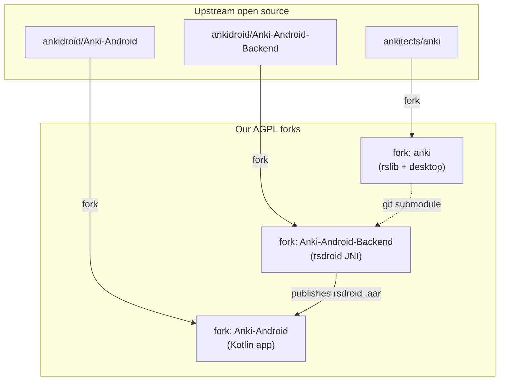
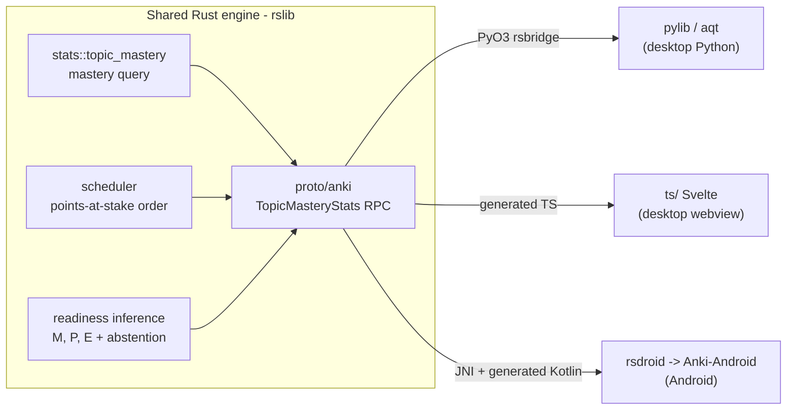
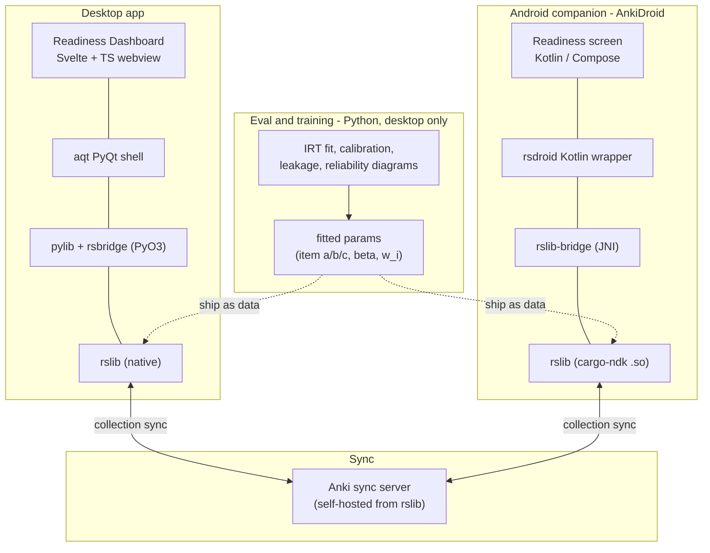

# Readygauge — Architecture & Tech Stack (MVP)

*How we fork Anki, what we build where, and the stack that makes one Rust engine power a desktop app and an Android companion. Companion to [PRD.md](PRD.md) and [MVP.md](MVP.md).*

---

## 1. The forking strategy (three repos, one engine)

The "shared engine" requirement is not satisfiable by forking a single repo. Anki's Android support lives in a separate bridge repo that includes the desktop Rust core as a **git submodule**. To put *our* Rust change on both platforms we fork three repos:

| Repo we fork | Upstream | Why we need it | Our changes |
|---|---|---|---|
| **anki** | `ankitects/anki` | The Rust core (`rslib`), protobuf API, Python/Qt desktop, Svelte webviews | Mastery query in `rslib`, new proto RPC, desktop readiness dashboard |
| **Anki-Android-Backend** | `ankidroid/Anki-Android-Backend` | The `rsdroid` JNI bridge; includes `anki` as a submodule and compiles `rslib` to an Android `.aar` | Repoint its `anki` submodule at **our** anki fork, rebuild the `.aar` |
| **Anki-Android** | `ankidroid/Anki-Android` | The Kotlin Android app that consumes the `rsdroid` `.aar` | Consume our `.aar`, add the readiness dashboard screen |

Because `rsdroid` auto-generates its Kotlin backend interface from `proto/anki/*.proto`, **our new protobuf RPC appears in Kotlin for free** once the submodule points at our fork. That is the whole reason this architecture clears the "shared engine, not a rewrite" bar: we write the mastery query once, in Rust, and both apps call it.



---

## 2. Where the shared Rust change lives

One implementation in `rslib`, consumed three ways.



- **Mastery query** (`rslib/src/stats/topic_mastery.rs`, new): per-topic `mastered_count`, `mean_retrievability`, `coverage_fraction`, `graded_reviews`. Fast aggregation over 50k cards — the reason it must be Rust, not Python.
- **Points-at-stake ordering** (`rslib/src/scheduler/`): due-card order by `w_i·(1−R_i)`; reuses the same aggregation.
- **Readiness inference** (`rslib/src/stats/readiness.rs`, new): composes M_s, applies fitted IRT/regression params (shipped as data), enforces the give-up rule, emits a `ReadinessReport`. Putting *inference* in Rust means desktop and Android show **identical** numbers from one codebase. (Model *training* stays in Python — §4.)
- **Protobuf** (`proto/anki/`): new messages/RPC; the single cross-language contract.

---

## 3. Runtime architecture (both apps, one engine, syncing)



**Data flow for one readiness view:** card reviews (both devices) → FSRS retrievability in `rslib` → mastery query aggregates per topic → readiness inference applies fitted params + give-up rule → `ReadinessReport` over protobuf → rendered as an `EvidencedValue` (never a bare number) in the Svelte dashboard (desktop) or Compose screen (Android). Reviews sync through the Anki sync server so both devices share one collection.

---

## 4. Tech stack decision

### Engine (shared)
- **Rust** — `rslib` core: mastery query, points-at-stake, readiness *inference*. Native on desktop; cross-compiled to Android via **cargo-ndk** through `rslib-bridge`.
- **Protocol Buffers (proto3)** — the cross-language API contract; one new service/messages.

### Desktop
- **Python 3** — `pylib` (backend wrapper) + `aqt` (app); `rsbridge` is the **PyO3** Rust↔Python bridge.
- **PyQt6 / Qt 6** — desktop shell (upstream default).
- **Svelte + TypeScript** — the readiness dashboard, rendered in Anki's existing webview, talking to the backend via the generated TS proto bridge (HTTP POST to the embedded backend).
- **Build:** `just` recipes → Anki's custom Rust build tool → **Ninja**; deps via `uv` (Python), `cargo` (Rust), Node/pnpm (TS).

### Android (companion)
- **Kotlin** — the app and the `rsdroid` wrapper; new dashboard screen in **Jetpack Compose** (or existing view system) calling the auto-generated backend method.
- **rsdroid `.aar`** — bundles `rslib` (JNI) + generated Kotlin; built locally with `local_backend=true` in `local.properties`.
- **Build:** Gradle (Android) + cargo-ndk (Rust → `.so`).

### Sync
- **Anki's own sync protocol**, self-hosted sync server compiled from `rslib`. Both apps already speak it — no custom sync to build for the MVP. **Conflict rule:** latest-review-timestamp wins, tie-break by device id (documented per PRD §11a).

### Analysis / evaluation (offline, desktop-only, not shipped in the hot path)
- **Python** — `numpy`/`scipy`/`scikit-learn` for IRT fitting, calibration (ECE, Brier decomposition, log loss), and the **leakage check** (TF-IDF 1–3 gram cosine). `matplotlib` for reliability diagrams.
- **One command** (`make eval`) reproduces every reported number on temporal held-out splits. Fitted parameters are exported as data files consumed by the Rust inference layer (§2), so training (Python) and inference (Rust) stay cleanly separated.

### AI layer (Friday, additive, off-switchable)
- Source-grounded generation + card checker live in **Python** on desktop, gated behind a feature flag; with AI off, the three scores still compute from the engine. (Detailed in PRD §9.)

### Why this split
- **Inference in Rust, training in Python.** The dashboard must hit sub-second/sub-500ms refresh on 50k cards (PRD §14) and must produce *identical* numbers on both platforms — that argues for one compiled inference path. Heavy, infrequent model fitting has no latency budget and is far easier in Python's scientific stack, so it stays offline and ships only its fitted parameters.

---

## 5. Repo layout after forking

```
anki-mcat-project/
  PRD.md  MVP.md  ARCHITECTURE.md
  anki/                      # fork of ankitects/anki
    rslib/src/stats/topic_mastery.rs    # NEW mastery query
    rslib/src/stats/readiness.rs        # NEW readiness inference
    rslib/src/scheduler/                # points-at-stake order
    proto/anki/                         # NEW messages + RPC
    pylib/  qt/  ts/                     # desktop consumers + dashboard
  Anki-Android-Backend/      # fork; submodule 'anki' -> our fork
  Anki-Android/              # fork; consumes our rsdroid .aar
  analysis/                  # Python eval/training (make eval)
    irt_fit.py  calibration.py  leakage_check.py
  data/
    aamc_outline.json        # topic ids + weights (coverage backbone)
    fitted_params.json       # exported for Rust inference
```

---

## 6. The fork commands (ready to run once execution is approved)

These are **not yet executed** (plan mode blocks non-readonly actions). On approval (switch to agent mode), run from the project root. Prereqs: `gh auth status` authenticated, `git`, Rust toolchain, Python `uv`, Node, Android SDK/NDK.

```bash
# 1. Fork + clone the engine/desktop repo
gh repo fork ankitects/anki --clone --fork-name readygauge-anki -- anki

# 2. Fork + clone the Android JNI bridge (has 'anki' as a submodule)
gh repo fork ankidroid/Anki-Android-Backend --clone --fork-name readygauge-anki-backend -- Anki-Android-Backend
git -C Anki-Android-Backend submodule update --init --recursive

# 3. Fork + clone the Android app
gh repo fork ankidroid/Anki-Android --clone --fork-name readygauge-ankidroid -- Anki-Android

# 4. License hygiene: keep AGPL-3.0-or-later, preserve BSD-3 parts, credit Anki (brief requirement)
```

Then verify the build spine **before any feature work** (per the brief's "Get Anki Building First" and MVP §7):
```bash
cd anki && just run        # desktop builds + launches from source
# repoint Anki-Android-Backend/anki submodule at our fork, build the .aar,
# set local_backend=true in Anki-Android/local.properties, build the APK.
```

---

## 7. Open decisions to confirm before execution

1. **Fork naming / account** — fork into your personal `gh` account with the names above, or a different org/name?
2. **One mega-repo vs. three sibling clones** — keep the three forks as sibling folders inside `anki-mcat-project/` (shown in §5), or nest them differently?
3. **Readiness inference language for the MVP** — Rust (identical on both platforms, more upfront work) vs. a faster MVP path computing readiness in Python on desktop first and porting to Rust/Kotlin after the spine works. (Recommendation: ship the **mastery query + memory layer in Rust now** since it's required, and start readiness inference in Python on desktop, then port — keeps the Wednesday gate achievable.)

Once you confirm these and approve execution (agent mode), I'll run the forks, get the desktop building from source, and stand up the AnkiDroid build on the shared engine.
