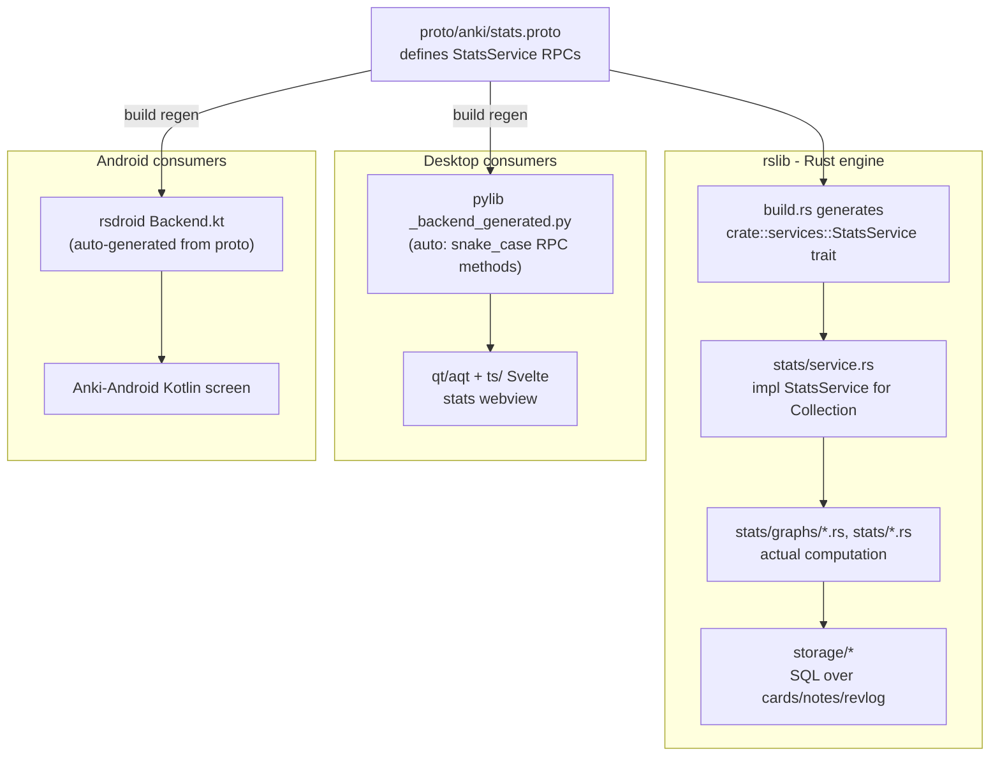
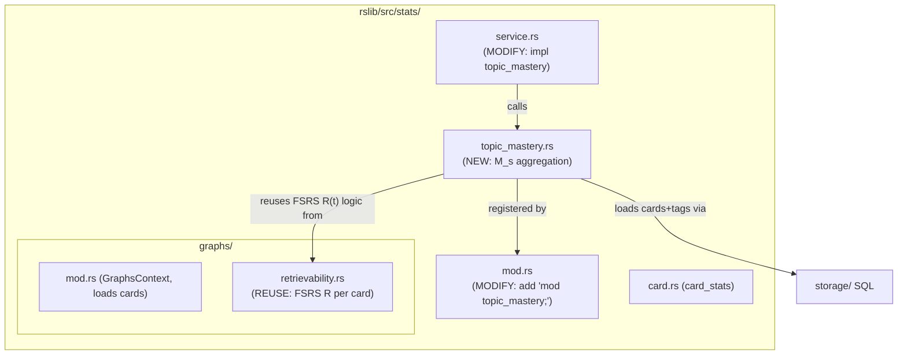

# Anki Codebase Map — Where the Mastery-Query Feature Lives

*A map of the real forked Anki codebase (`anki/`) annotated with the exact files we create/modify for the readiness feature. Companion to [ARCHITECTURE.md](ARCHITECTURE.md). Verified against the actual source we cloned and built.*

> Feature in scope here: the **mastery query** (per-topic mastered count, mean FSRS retrievability, coverage) that powers the **Memory score (M_s)** and the abstention gate. This is the Wednesday Rust deliverable. Performance/Readiness layers reuse the same wiring and are noted as follow-ons.

---

## 1. How a backend call flows through Anki (the pattern we copy)

Anki is one Rust engine (`rslib`) wrapped by Python (desktop) and Kotlin (Android), with **Protocol Buffers as the single cross-language contract**. Adding a feature means: define it in `.proto`, implement it in `rslib`, and it auto-surfaces in Python and Kotlin.

The key leverage: **`proto/anki/stats.proto` is the one file that fans out to all three languages.** Add an RPC there once, and the Python (`_backend_generated.py`) and Kotlin (`rsdroid` `Backend`) bindings regenerate automatically at build time. We only hand-write the Rust implementation.

---

## 2. The `rslib/src/stats` module (where M_s is computed)

The existing stats module is the exact template for our mastery query. Note `graphs/retrievability.rs` already computes FSRS retrievability per card — our M_s aggregation reuses that same `fsrs.current_retrievability_seconds(...)` call, grouped by AAMC topic instead of binned into a histogram.

What `topic_mastery.rs` does (mirrors `retrievability.rs`'s structure):
- Load cards (with `memory_state`, `decay`) joined to their note **tags** (the MCAT topic markers, e.g. `mcat::bb::amino_acids`).
- For each card, compute `R_i = fsrs.current_retrievability_seconds(state, elapsed, decay)` — identical to `retrievability.rs:34`.
- Group by AAMC topic; emit per-topic `mastered_count` (R_i > threshold), `mean_retrievability`, `graded_reviews`, and `coverage_fraction` (topics-with-cards / topics-in-AAMC-outline).

---

## 3. Exact file modification map

### Engine — `rslib` + proto (the graded Rust change, ships to both platforms)

- `anki/proto/anki/stats.proto` **[MODIFY]** — add to `StatsService`:
  - `rpc TopicMastery(TopicMasteryRequest) returns (TopicMasteryResponse);`
  - new messages: `TopicMasteryRequest { string topic_prefix = 1; float mastered_threshold = 2; }`, `TopicMasteryResponse { repeated TopicMasteryStats topics = 1; }`, `TopicMasteryStats { string topic_id, uint32 mastered_count, float mean_retrievability, float coverage_fraction, uint32 graded_reviews }`.
- `anki/rslib/src/stats/topic_mastery.rs` **[NEW]** — the aggregation logic (M_s, coverage, evidence counts).
- `anki/rslib/src/stats/mod.rs` **[MODIFY]** — register `mod topic_mastery;` (currently lines 4-7).
- `anki/rslib/src/stats/service.rs` **[MODIFY]** — implement `fn topic_mastery(&mut self, input) -> Result<...>` inside `impl crate::services::StatsService for Collection` (line 7).
- `anki/rslib/src/storage/card/` **[MODIFY / NEW SQL]** — an efficient query joining `cards` + `notes.tags` + memory state so the dashboard hits its 50k-card / sub-500ms budget (the justification for doing this in Rust, not Python).
- **Tests [NEW]** — `topic_mastery.rs` unit tests (≥3) + a Python-calling test (brief 7a requires both); plus an undo/no-corruption check.

### Desktop consumers (mostly auto-generated)

- `anki/pylib/anki/_backend_generated.py` **[AUTO]** — regenerated; exposes `col._backend.topic_mastery(...)`. No manual edit.
- `anki/pylib/anki/stats.py` **[MODIFY, optional]** — a thin convenience wrapper.
- `anki/ts/routes/` **[NEW]** — a Readiness dashboard page (new `readiness/+page.svelte` + components) rendering each score as an `EvidencedValue`; reuse patterns from `ts/routes/graphs/*.svelte` (e.g. `RetrievabilityGraph.svelte`, `GraphsPage.svelte`).
- `anki/qt/aqt/` **[MODIFY]** — register the new webview route / menu entry to open the dashboard (alongside `qt/aqt/stats.py`).

### Android consumers

- `Anki-Android-Backend` `rsdroid` Kotlin `Backend` **[AUTO]** — regenerated from proto when we rebuild the `.aar`; `topicMastery(...)` appears for free.
- `Anki-Android/AnkiDroid/src/.../` **[NEW]** — a Kotlin/Compose readiness screen calling `backend.topicMastery(...)`.

### Off-engine (offline Python, not in the latency path)

- `analysis/` **[NEW]** — calibration (ECE/Brier/log loss), leakage check, later IRT fit. `data/aamc_outline.json` **[NEW]** — topic IDs + weights, the coverage backbone.

---

## 4. Follow-on features (same wiring, later)

- **Points-at-stake queue** — `anki/proto/anki/scheduler.proto` [MODIFY] + `anki/rslib/src/scheduler/queue/builder/sorting.rs` [MODIFY] to order due cards by `w_i·(1−R_i)`.
- **Readiness inference (M/P/E + abstention)** — `anki/rslib/src/stats/readiness.rs` [NEW], consuming fitted params (IRT item params, β coefficients) shipped as data from the offline Python.

---

## 5. Minimal change surface (summary)

For the Wednesday mastery-query deliverable, the hand-written change is just **four files** in the engine:

- `proto/anki/stats.proto` (contract)
- `rslib/src/stats/topic_mastery.rs` (logic, NEW)
- `rslib/src/stats/mod.rs` (one line)
- `rslib/src/stats/service.rs` (impl)

Everything downstream (Python bindings, Kotlin bindings) regenerates from the proto change — which is precisely why this satisfies the brief's "one shared engine change that ships to both desktop and phone."
