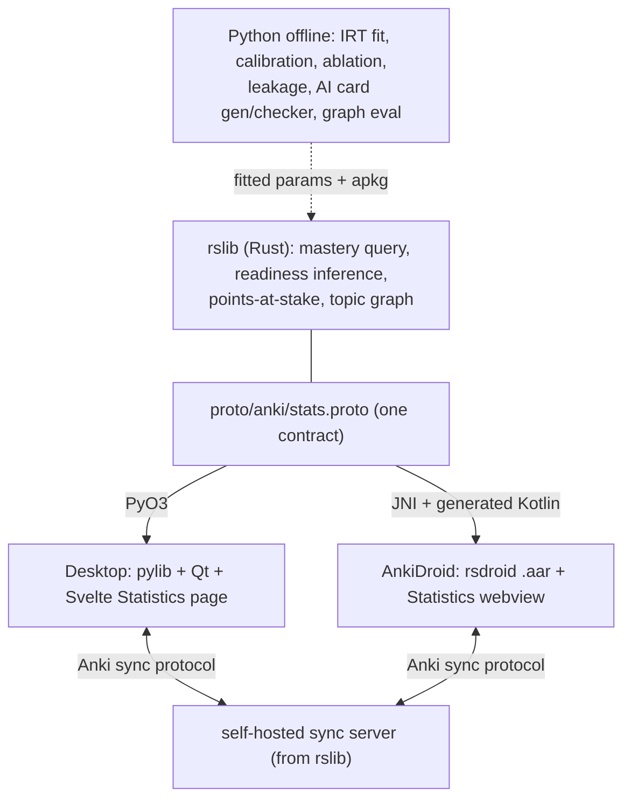

# Readygauge — an MCAT readiness engine built on Anki

**Exam: the MCAT** (scored 472–528; four sections B/B, C/P, P/S, CARS each 118–132). A desktop app and an Android companion share **one forked Rust engine** and answer three separate questions honestly — *can you recall this?*, *can you apply it to a new question?*, and *what would you score, and how sure are we?* — refusing to show a number it cannot defend.

This is a fork of [Anki](https://apps.ankiweb.net/) and [AnkiDroid](https://github.com/ankidroid/Anki-Android). License: **AGPL-3.0-or-later**, with credit to Ankitects Pty Ltd and the AnkiDroid project (some upstream parts are BSD-3-Clause; preserved).

---

## The three repos (all forked, all AGPL)

| Fork | Upstream | Role | Our branch |
|---|---|---|---|
| [anshulmago1/anki](https://github.com/anshulmago1/anki) | ankitects/anki | Rust engine (`rslib`) + desktop (Python/Qt) + shared web frontend (`ts/`) | `mcat-readiness` |
| [anshulmago1/Anki-Android-Backend](https://github.com/anshulmago1/Anki-Android-Backend) | ankidroid/Anki-Android-Backend | `rsdroid` JNI bridge; includes `anki` as a submodule, compiles `rslib` to an Android `.aar` | `mcat-readiness` |
| [anshulmago1/Anki-Android](https://github.com/anshulmago1/Anki-Android) | ankidroid/Anki-Android | Kotlin phone app that consumes the `.aar` | `mcat-readiness` |

The **one shared engine change** is written once in Rust (`rslib`) and ships to both platforms because the phone backend includes the desktop engine as a git submodule and regenerates its Kotlin bindings from the same protobuf.

---

## What we built (the readiness model)

Every displayed number is an `EvidencedValue` — value + range + confidence + the reviews/coverage/calibration behind it. Nothing shows without its evidence.

- **Memory (M):** FSRS-6 retrievability, aggregated per AAMC topic from your real reviews (models the forgetting curve).
- **Performance (P):** 3PL IRT — the probability you answer a *new* exam-style question right (transfer, not recall). Computed live in the app (grid-MLE ability θ + Fisher-information SE, a direct port of `analysis/irt_fit.py`), not a `correct/total` proxy. The M−P "paraphrase gap" is a first-class output (real recall→transfer items in `analysis/perf_bridge.py`).
- **Readiness (E):** coverage-gated map to the 118–132 section scale, summed to a 472–528 total with a range and AAMC-style confidence band.
- **Give-up rule:** withholds a score until a section has ≥200 graded reviews, ≥50% coverage, and a tight enough IRT SE.
- **Next-best-action + knowledge graph:** a ranked "do this next" list and an interactive prerequisite graph (nodes colored by mastery) — both proven to beat keyword/vector baselines.
- **Graph-guided AI card generation:** the graph selects your highest-value, prerequisite-ready weak topics; the local LLM generates source-grounded, checker-verified cards for exactly those topics (`make ai-targeted`). The targeting decision beats random/weight/due baselines and never wastes budget on a prerequisite-blocked topic.
- **Learning-science multipliers** (spacing, interleaving, testing) tied to published effect sizes (Cepeda 2008, Bjork/Rohrer, Dunlosky 2013). Honesty: they are **neutral (1.0) in the live score** until session-level study quality is measured — no unearned boost — and are exercised in the interleaving ablation instead.

See [PRD.md](PRD.md) for the full product spec and [docs/models/](docs/models/) for one-page descriptions of each model.

---

## The Rust engine change (graded 20%)

See [docs/RUST_CHANGE.md](docs/RUST_CHANGE.md) for the one-page note and the list of upstream files touched with merge-difficulty. In brief: new RPCs on `StatsService` (`TopicMastery`, `ComputeReadiness`, `PointsAtStakeOrder`, `TopicGraph`) implemented in `anki/rslib/src/stats/`, with ≥11 Rust unit tests + Python-calling tests, undo-safe and read-only over the collection.

---

## Architecture



Full detail: [ARCHITECTURE.md](ARCHITECTURE.md) and [CODEBASE_MAP.md](CODEBASE_MAP.md).

---

## Build & run

### Prerequisites
- Rust (rustup; the pinned toolchain auto-installs), Python 3 with `uv`, Node, Ninja, protoc, a C toolchain.
- Android: JDK 21, Android SDK + NDK `29.0.14206865`, `cargo-ndk`.

### Desktop (from source)
```bash
cd anki
export PATH="$HOME/.cargo/bin:$PATH"
./run                     # build + launch
# or open a specific collection base:
./run -b /path/to/base
```

### Desktop installer (.dmg)
```bash
cd anki && RELEASE=1 ./ninja installer
# -> out/installer/dist/anki-*-mac-apple.dmg
```
Open the `.dmg` and drag **Anki.app** into **/Applications** — the Dock/Launchpad icon
then launches the fork (it replaces the stock Anki; your card data is untouched). The
build is ad-hoc signed, so on a clean Mac use right-click → Open once to pass Gatekeeper.

### Android (emulator or device)
```bash
# 1. build the shared engine into an .aar
cd Anki-Android-Backend && bash build.sh
# 2. build + install the app
cd ../Anki-Android
echo "local_backend=true" >> local.properties
./gradlew assembleFullDebug
adb install -r AnkiDroid/build/outputs/apk/full/debug/AnkiDroid-full-arm64-v8a-debug.apk
```

### Evaluation, AI, benchmark (from `analysis/`)
```bash
cd analysis
make venv          # one-time: numpy venv
make eval          # calibration, IRT, ablation, leakage, real-paraphrase, graph-vs-baselines -> RESULTS.md
make ai            # Ollama RAG card generation + gold-set checker + injection defense (needs `ollama serve`)
make ai-targeted   # graph-guided targeted generation: graph picks weak topics -> grounded+checked cards -> MCAT_Targeted.apkg
make bench         # 50k-card speed benchmark vs section-10 targets (p50/p95/worst)
make crash         # 20x mid-review SIGKILL: zero corruption + AI-off offline score
python sync_test.py  # two-device offline merge + conflict rule (7b)
make demo          # build a real tagged MileDown collection + live dashboard
```

---

## Sync

Both apps share one collection via Anki's own sync protocol (self-hosted server compiled from `rslib`). Conflict rule and the 7b offline-merge evidence: [docs/SYNC.md](docs/SYNC.md).

---

## Verify it

[docs/VERIFICATION.md](docs/VERIFICATION.md) indexes captured test output (Rust/Python/Svelte tests, `make eval/ai/ai-targeted/bench/crash`, the 7b sync test) and [deployment evidence](docs/verification/deployment.md) (the `.dmg` with a pinned SHA-256, the signed APK, and the shared-engine `.aar`), each with a one-line reproduce command.

---

## Spec coverage & evidence

### Rules you cannot break (Speedrun sec. 2)

| Rule | Status | Evidence |
|---|---|---|
| Real change inside Anki's **Rust** code (not just Python screens) | ✅ | 4 RPCs in `anki/rslib/src/stats/` — [docs/RUST_CHANGE.md](docs/RUST_CHANGE.md), [rust_tests.txt](docs/verification/rust_tests.txt) (15 pass) |
| **Two apps, one engine**, reviews/progress sync | ✅ | desktop + AnkiDroid run the forked `rslib`; [docs/SYNC.md](docs/SYNC.md), [sync_test.txt](docs/verification/sync_test.txt) |
| **Three separate scores** (memory / performance / readiness), each a range | ✅ | `ReadinessCard.svelte` + `compute_readiness`; [RESULTS.md §3](analysis/RESULTS.md) |
| Test models on **held-out** data, re-runnable | ✅ | temporal splits; `make eval`; [VERIFICATION.md](docs/VERIFICATION.md) |
| One study feature: **write expectation, ablate on/off** | ✅ | interleaving ablation V1/V2/V3; [RESULTS.md §5](analysis/RESULTS.md) |
| Every AI output from a **named source, checked, beats a baseline** | ✅ | RAG + gold-set checker, 0.75 vs 0.0; [make_ai.txt](docs/verification/make_ai.txt), [RESULTS.md §7](analysis/RESULTS.md) |
| App **refuses a score** without enough data | ✅ | give-up rule (≥200 reviews, ≥50% coverage, IRT SE); [RESULTS.md §3](analysis/RESULTS.md) |
| Ship a **desktop installer + phone build**, both run with **AI off** | ✅ | [deployment.md](docs/verification/deployment.md); AI-off score in [crash_test.txt](docs/verification/crash_test.txt) |
| **AGPL-3.0-or-later** + credit to Anki | ✅ | LICENSE preserved in all forks; credit at top of this README |

### Concrete challenges (Speedrun sec. 7)

| # | Challenge | Status | Evidence |
|---|---|---|---|
| 7a | Rust change + 3 Rust tests + 1 Python test + undo-safe | ✅ | [docs/RUST_CHANGE.md](docs/RUST_CHANGE.md); [rust_tests.txt](docs/verification/rust_tests.txt), [python_tests.txt](docs/verification/python_tests.txt) |
| 7b | Sync: offline both sides merge, conflict rule | ✅ | 20/20 merged, no double-count, LWW — [sync_test.txt](docs/verification/sync_test.txt), [docs/SYNC.md](docs/SYNC.md) |
| 7c | Coverage map; abstain if under line | ✅ | AAMC outline coverage % + abstain; [data/aamc_outline.json](data/aamc_outline.json), [RESULTS.md §3](analysis/RESULTS.md) |
| 7d | Paraphrase test (recall vs reworded) | ✅ | real recall→transfer items, gap measured — [RESULTS.md §2b](analysis/RESULTS.md), `analysis/perf_bridge.py` |
| 7e | Leakage check | ✅ | TF-IDF detector, self-tested — [RESULTS.md §4](analysis/RESULTS.md) |
| 7f | AI card check: 50-item gold set, correct/wrong/poor, cutoff | ✅ | [make_ai.txt](docs/verification/make_ai.txt); `data/ai/gold_set.json` |
| 7g | Crash (20× kill, zero corruption) + offline | ✅ | 0/20 corrupted — [crash_test.txt](docs/verification/crash_test.txt) |
| 7h | One-command benchmark on 50k deck | ✅ | `make bench` — [make_bench.txt](docs/verification/make_bench.txt) (honest p95 note in [VERIFICATION.md](docs/VERIFICATION.md)) |
| sec.13 | Bonus: knowledge graph beats keyword + vector | ✅ | +14.3 / +18.5 pts — [RESULTS.md §6](analysis/RESULTS.md). Study-planner head-to-head (200 students) vs **real** TF-IDF + `nomic-embed-text` search: **+1.8 exam pts @10, 95% CI excludes 0** (NDCG 0.82 vs 0.63/0.62). Honest mechanism: text senses topical relatedness (undirected AUC 0.86–0.90) but **not prerequisite *direction*** (dir. acc = 0.5 = chance); the win **degrades to zero when the graph is made inaccurate** (robustness table) — so it's the graph's structure, not a rigged setup, that helps. `make plan` — [RESULTS.md §11](analysis/RESULTS.md), [study_plan.txt](docs/verification/study_plan.txt) |

### Score model (Speedrun sec. 9)

| Step | Status | Evidence |
|---|---|---|
| 1 — memory calibrated (Brier/log-loss on held-out) | ✅ | ECE 0.008, beats baseline — [RESULTS.md §1](analysis/RESULTS.md), [docs/models/memory.md](docs/models/memory.md) |
| 2 — performance on held-out exam-style questions | ✅ | 3PL IRT, AUC 0.74 beats keyword/vector — [RESULTS.md §2](analysis/RESULTS.md), [docs/models/performance.md](docs/models/performance.md) |
| 3 — score mapping with a range, method written down | ✅ | logit map, documented, honest calibration caveat — [docs/models/readiness.md](docs/models/readiness.md) |
| 4 — validate vs real students (bonus) | ⛔ honest gap | no longitudinal study+FL data in a week; labeled not-yet-field-calibrated (sec. 9 prefers this over a fabricated number) |

### What to hand in (Speedrun sec. 12)

- **Public AGPL fork, credit to Anki, exam stated up front, build instructions (both apps), architecture, Rust-change note, files touched** — this README + [docs/RUST_CHANGE.md](docs/RUST_CHANGE.md) + [ARCHITECTURE.md](ARCHITECTURE.md).
- **Model descriptions (one page each)** — [docs/models/memory.md](docs/models/memory.md), [performance.md](docs/models/performance.md), [readiness.md](docs/models/readiness.md).
- **Brainlift** — [Brainlift Week 2.pdf](Brainlift%20Week%202.pdf).
- **Demo video (3–5 min)** — shot list in [docs/DEMO_SCRIPT.md](docs/DEMO_SCRIPT.md); installer-recording runbook in [deployment.md](docs/verification/deployment.md). *(The video itself is the one artifact recorded by hand.)*

### How it maps to the grade (Speedrun sec. 11)

| Area | Weight | Where |
|---|---|---|
| Rust change & fit with Anki | 20% | [docs/RUST_CHANGE.md](docs/RUST_CHANGE.md), `anki/rslib/src/stats/` |
| Score accuracy & honest uncertainty | 20% | [RESULTS.md §1–3](analysis/RESULTS.md), [docs/models/](docs/models/) |
| Study feature (learning science) | 15% | ablation — [RESULTS.md §5](analysis/RESULTS.md) |
| AI checking & safety | 15% | [RESULTS.md §7/7b](analysis/RESULTS.md), injection defense |
| Fair, re-runnable tests | 12% | [docs/VERIFICATION.md](docs/VERIFICATION.md) |
| Two apps / one engine + sync | 10% | [docs/SYNC.md](docs/SYNC.md), [sync_test.txt](docs/verification/sync_test.txt) |
| Useful product & clean UX | 8% | readiness card + interactive knowledge graph (both apps) |

---

## Honesty

We do not have real student study-history + full-length-score longitudinal data, so we grade the **steps of the bridge** (calibrated memory, held-out performance, documented score mapping) and label the readiness coefficients **not yet field-calibrated**. Results and limitations: [analysis/RESULTS.md](analysis/RESULTS.md). Additional honest positions: the live learning-science multipliers are neutral (no unearned boost); two full-collection benchmark scans are marginally over the 500 ms refresh p95 on a loaded machine (reported as measured, not gamed); the performance/paraphrase outcomes on real items are model-projected where noted.

---

## Repo layout
- `anki/` — engine + desktop fork
- `Anki-Android/`, `Anki-Android-Backend/` — phone forks
- `analysis/` — Python eval/AI/benchmark harness (`make …`)
- `data/` — AAMC outline, knowledge graph, gold set, generated eval artifacts
- `PRD.md`, `MVP.md`, `ARCHITECTURE.md`, `CODEBASE_MAP.md`, `REMAINING_WORK.md` — design docs
- `docs/` — Rust-change note, model one-pagers, sync doc, demo script
